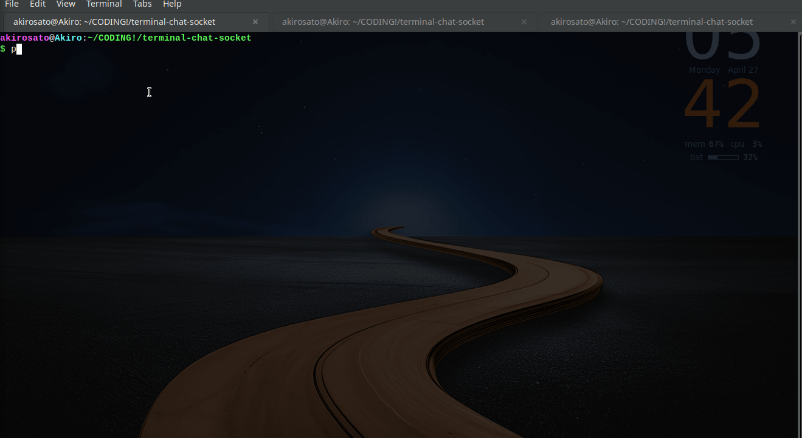

# ⚡ Terminal Chat (Socket Server)

A hacker-style terminal chat server built with Python sockets.  
Supports multi-client communication, authentication, message storage, and admin control.

---

## 🧠 Overview

TCP-based chat system with:
- real-time communication  
- terminal interface  
- modular backend  

---

## 🚀 Features

- 🔐 Authentication  
- 💬 Multi-client chat  
- 🧵 Threaded server  
- 🗃️ SQLite message storage  
- 📜 Chat history  
- ⚡ Broadcast system  
- 🛡️ Rate limiting  
- 🧑‍💻 Admin console  

---

## 🧩 Architecture

    Client → Server (TCP)
              ├── auth.py
              ├── msg.py
              ├── admin.py
              └── main.py

---

## 📦 Project Structure

    .
    ├── main.py
    ├── client.py
    ├── auth.py
    ├── msg.py
    ├── admin.py
    └── README.md

---

## ⚙️ Setup

### Clone
    git clone https://github.com/yourusername/your-repo.git
    cd your-repo

### Run server
    python main.py

### Run client
    python client.py

---

## 🎥 Demo

---

## 🌐 Network

Local:
    192.168.x.x:12345

Public:
- ngrok / cloudflare  
- VPS  

---

## ⚠️ Notes

- DB files ignored via `.gitignore`  
- Thread-based  
- No encryption  

---

## 🧭 Roadmap

- [ ] /dm  
- [ ] /who  
- [ ] /nick  
- [ ] admin tools  

---

## 📜 License
MIT
